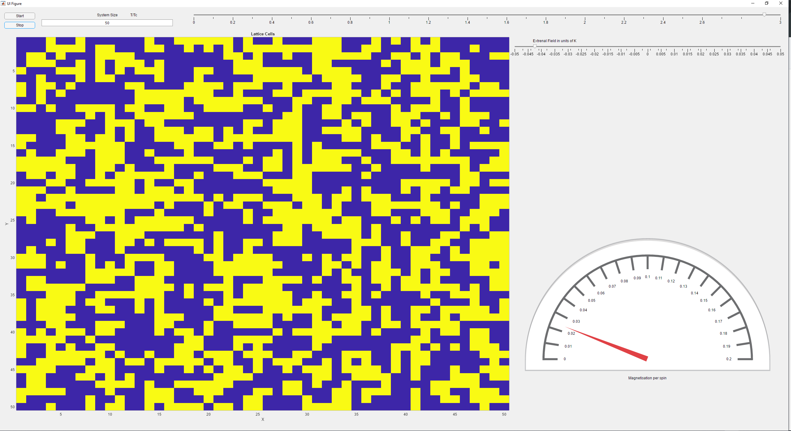
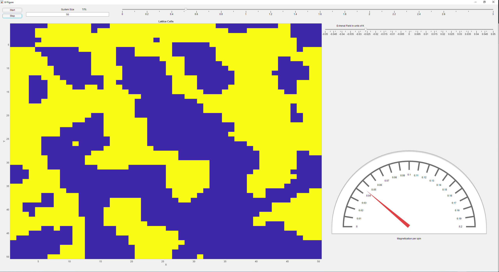

# 🧲 2D Ising Model Simulation (MATLAB GUI)

This project implements a 2D Ising Model using the **Metropolis Monte Carlo algorithm** to demonstrate phase transitions in ferromagnetic materials.

Built using MATLAB App Designer, the simulation allows interactive exploration of the system behavior under different:
- Temperatures (relative to critical temperature Tc)
- System Sizes
- External magnetic fields

---

## 🎮 Features

- GUI-based controls: Temperature slider, field adjustment, system size input
- Visualization of spin configurations
- Magnetization per spin gauge
- Energy calculation function (`StateEnergyP.m`)

---

## 🧠 Physics Overview

The 2D Ising Model simulates a grid of magnetic spins (`+1`, `-1`) that interact with their neighbors. It undergoes a phase transition at a critical temperature **Tc**, transitioning from a disordered to an ordered state.

This simulation uses the **Metropolis algorithm** to:
- Randomly propose spin flips
- Accept or reject flips based on energy change and temperature
- Periodic boundary conditions

---

## ▶️ How to Run

1. Open `IsingModel.mlapp` in MATLAB's **App Designer**
2. Click **Run**
3. Use the sliders and input fields to explore the system
4. Visual output and magnetization are shown in real time

---

## 📸 Screenshots

**High-temperature (disordered state):**

**Low-temperature (ordered domains emerging):**

---

## 📜 License

This project is licensed under the MIT License — see the [LICENSE](./LICENSE) file for details.
